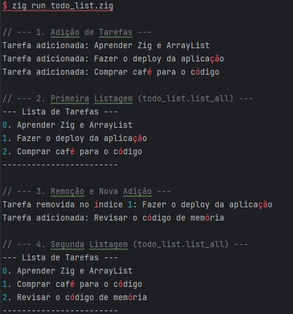

# Array List 
### O std.ArrayList(T) e a Gestão Explícita de Memória em Zig
 
O std.ArrayList(T) é a estrutura de dados em Zig para 
se criar uma lista dinâmica — uma coleção contígua de 
elementos de um tipo T que pode crescer ou encolher em 
tempo de execução. Em contraste com as arrays de 
tamanho fixo ([N]T) e as 
slices de apenas visualização ([]T), o ArrayList 
gerencia ativamente a memória necessária para 
armazenar seus elementos, 
tornando-o essencial para a maioria das aplicações 
dinâmicas.
O aspecto mais importante do ArrayList é que ele não 
gerencia a memória por conta própria; ele exige que 
você forneça um 
alocador (std.mem.Allocator). Essa é a filosofia 
central de Zig: a alocação de memória é explícita. O 
alocador é 
responsável por reservar mais espaço na heap (memória 
dinâmica) quando a lista atinge sua capacidade máxima 
e precisa 
crescer. 

---
### O Fluxo de Vida e os Comandos do ArrayList
O uso correto de um ArrayList segue um ciclo rigoroso 
de alocação e liberação de recursos, garantido pela 
palavra-chave 
defer.
### 1. Inicialização e Alocação da Memória Base
Antes de usar o ArrayList, precisamos de uma fonte de 
memória: o alocador.
- var gpa = std.heap.GeneralPurposeAllocator(.{}){};: Este comando cria uma instância de um alocador de uso geral (GeneralPurposeAllocator ou GPA). Ele é o gerente de memória de alto nível.
- const allocator = gpa.allocator();: Obtemos a interface (Allocator) que passaremos para as estruturas de dados.
- var list = std.ArrayList(T).init(allocator);: Aqui, o ArrayList é inicializado, recebendo o alocador que usará para todas as operações futuras de redimensionamento e crescimento.
### 2. Adição de Elementos (append e dupe)
O comando fundamental para adicionar itens é o append. 
No entanto, quando trabalhamos com tipos que não são 
copiados por 
valor (como slices ou strings, representadas por []
const u8), a memória deve ser gerenciada com cuidado.
- try list.append(item);: Adiciona um elemento ao final da lista. A operação pode falhar com o erro error.OutOfMemory se o alocador não conseguir encontrar espaço para o crescimento da lista, por isso usamos o prefixo try.
- try allocator.dupe(u8, fatia);: Este comando é crucial no nosso exemplo de lista de tarefas. Como strings em Zig são slices (apenas referências), dupe aloca um novo bloco de memória na heap, copia o conteúdo da fatia original e retorna a propriedade da nova cópia. O ArrayList armazena esta cópia, garantindo que a memória não seja liberada por engano em outro lugar (evitando Use After Free).
### 3. Acesso e Modificação
Para acessar os dados, o ArrayList expõe o campo .items, que é uma slice da memória interna:
- list.items: Retorna uma []T (slice de T). É o caminho para ler ou iterar sobre os elementos.
- list.items.len: Retorna o número atual de elementos (usize).
- _ = list.orderedRemove(index);: Remove o elemento no index especificado. É importante notar que, antes de chamar orderedRemove, devemos liberar manualmente a memória do elemento se ele foi alocado via dupe (como a nossa string). A função orderedRemove mantém a ordem dos elementos restantes.
### 4. O Passo Mais Crítico: Desinicialização (deinit e defer)
A alocação deve ser pareada com a desliberação. Em Zig, isso é frequentemente garantido pelo defer:
- defer list.deinit();: No final da função, defer garante que a função deinit seja chamada. A list.deinit() libera a memória do array interno que o ArrayList usava para armazenar os elementos.
- A Regra da Duplicação (Cleanup em deinit): Se você usou dupe para alocar memória para os elementos (as strings), a sua função deinit personalizada no TodoList deve primeiro iterar sobre todos os elementos e chamar allocator.free(item) para liberar cada string, antes de chamar list.deinit(). Isso é a essência do gerenciamento explícito de recursos em Zig.
- defer _ = gpa.deinit();: Finalmente, a desinicialização do GeneralPurposeAllocator libera toda a memória remanescente sob sua responsabilidade.
  
Em resumo, o std.ArrayList(T) em Zig é uma ferramenta poderosa para coleções dinâmicas, mas exige disciplina com o 
alocador (Allocator) e a garantia de que cada alocação (init, append, dupe) seja correspondida por uma liberação (deinit, 
free), geralmente orquestrada pela palavra-chave defer.

---
## Exemplo na prática de uma ArrayList:

- [Implementação do código](../Códigos-fonte/Zig/ArrayList.zig)

