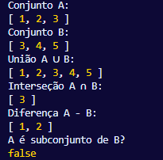

# Conjuntos em JavaScript
## Conceituação e Propriedades de Unicidade
Um conjunto é uma coleção de elementos 
distintos e não ordenados, fundamentado 
diretamente na teoria matemática dos 
conjuntos. Em JavaScript, embora exista a 
estrutura de dados Set nativa, é instrutivo 
compreender como implementar manualmente essa 
estrutura para dominar os conceitos 
subjacentes e para contextos onde o uso de 
estruturas nativas não é possível ou desejado.
  
A principal característica de um conjunto é 
que nenhum elemento pode aparecer mais de uma 
vez na coleção. Essa propriedade é 
frequentemente implementada utilizando-se a 
estrutura de objeto em JavaScript, onde as 
chaves são únicas por natureza, oferecendo 
assim uma maneira eficiente de verificar a 
existência de um elemento.

---
## Implementação Manual com Objetos JS
A implementação de um conjunto em JavaScript 
envolve a criação de uma classe que utiliza um 
objeto interno para armazenar os elementos. A 
chave e o valor do objeto são geralmente 
definidos como o próprio elemento, 
aproveitando o fato de que as chaves de um 
objeto em JavaScript são sempre strings ou 
símbolos, o que implica em uma conversão 
implícita para string para outros tipos de 
dados. Essa conversão é um ponto de atenção, 
pois pode levar a comportamentos inesperados.
  
As operações básicas são implementadas da seguinte forma:

---
- adicionar(elemento): Antes 	de inserir, verifica-se se a chave já existe no objeto interno 	usando Object.prototype.hasOwnProperty.call() , um método robusto para evitar conflitos. Se não existir, o elemento é adicionado como uma chave-valor.
- remover(elemento): Utiliza o operador delete para remover a propriedade do objeto interno correspondente ao elemento.
- contem(elemento): 	Verifica a existência da chave no objeto interno, também 	utilizando a verificação segura com hasOwnProperty. 
Uma decisão de projeto importante nesta 
implementação é o retorno de um booleano nas 
operações de adição e remoção, informando se a 
operação foi bem-sucedida (isto é, se o 
elemento foi de fato adicionado ou removido), 
o que aumenta a utilidade da classe para o 
usuário.

---
## Operações de Conjunto e Iteração
Além das operações básicas, é fundamental implementar as operações clássicas da teoria dos conjuntos:

---
- uniao(outroConjunto): Cria um novo conjunto e adiciona todos os elementos do conjunto 	atual e do conjunto passado como parâmetro. A propriedade de unicidade é mantida naturalmente pelo método adicionar 
- interseccao(outroConjunto): Percorre os elementos do conjunto atual e adiciona ao novo conjunto 	apenas aqueles que também estão presentes no outro conjunto 	
- diferenca(outroConjunto): 	Percorre os elementos do conjunto atual e adiciona ao novo conjunto apenas os que não estão presentes no outro conjunto. 
- ehSubconjunto(outroConjunto): Utiliza o método every()  para verificar se todos os elementos do 	conjunto atual estão contidos no outro conjunto.
---
Para permitir a interação e inspeção, os 
métodos valores() e imprimir() são 
implementados. O método valores() utiliza 
Object.values() para retornar um array com 
todos os elementos, enquanto imprimir() exibe 
esse array no console. A conversão para array 
é necessária porque o objeto interno não 
preserva uma ordem específica, reforçando a 
natureza não ordenada do conjunto.

---
## Exemplo de Aplicação e Comportamento
Conjuntos são amplamente utilizados em 
algoritmos para eliminar duplicatas de listas, 
verificar a existência de elementos de forma 
eficiente e realizar comparações lógicas entre 
coleções. A execução do código de exemplo 
demonstra o comportamento esperado:

- [Implementação de conjunto](../Códigos-fonte/JavaScript/Conjunto.js)

