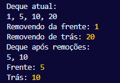

# A Fila Dupla (Deque)
A fila dupla, ou Deque (Double-Ended Queue), 
estende o conceito da fila simples, permitindo que 
a inserção e a remoção de elementos ocorram tanto 
no início quanto no final da estrutura. Essa 
flexibilidade é implementada em JavaScript 
combinando os métodos push( )  e pop( ) (para 
operações no final) com unshift( ) e shift( ) (para 
operações no início).
  
A classe Deque herda a mesma base de array da fila 
simples, mas expõe uma API ampliada:
- adicionarFrente(elemento) e adicionarTras(elemento): Usam unshift( ) e push( ), respectivamente.
- removerFrente() e removerTras(): Usam shift() e pop(), respectivamente.
  
É crucial notar que, assim como shift , o método
unshift também possui complexidade O(n) em engines
de JavaScript padrão, pois precisa reindexar o
array ao inserir um elemento no início. Portanto,
embora o Deque ofereça maior flexibilidade
operacional, ele compartilha a mesma potencial
limitação de performance para volumes muito altos
de dados. Para cenários que exigem performance
constante (O(1)) em ambas as extremidades, uma
implementação com listas ligadas seria mais
adequada, ainda que mais complexa.
  

## Exemplo de Aplicação
As filas são amplamente utilizadas em JavaScript
para gerenciamento de tarefas em sequência, como
em:

---
- Buffer 	de comandos em aplicações interativas.	
- Algoritmos de busca em largura (BFS) para grafos e árvores.	
- Processamento de mensagens em sistemas de comunicação.
---
A implementação de referência (disponível no
repositório) demonstra o funcionamento prático de
ambas as estruturas. A execução do código
exemplifica o comportamento FIFO da fila simples e
a natureza bidirecional do Deque.

- [Implementação de deque](../Códigos-fonte/JavaScript/Deque.js)

---
