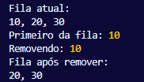

# Filas em JavaScript
## Conceituação e Princípio FIFO
As filas são estruturas de dados lineares do 
tipo FIFO (First In, First Out), onde o 
primeiro elemento inserido é o primeiro a ser 
removido. Essa estrutura é fundamental em 
JavaScript, não apenas na implementação de 
diversos algoritmos, como também no próprio 
funcionamento da linguagem, que utiliza uma 
event loop baseada em filas de tarefas para 
gerenciar Pilha de Chamadas e a Fila de 
Retornos.
  
Em JavaScript, a ausência de uma implementação 
nativa de fila na biblioteca padrão é 
contornada utilizando arrays e como também 
seus métodos embutidos. Por serem flexíveis os 
arrays em JavaScript com dinamicidade de 
tamanho e métodos de alta ordem se tornam 
eficazes para simular os comportamentos de 
filas, embora com ressalvas sobre seu uso, 
principalmente se levar em consideração a sua 
performance para operações em larga escala.

---
## Implementação de Fila Simples com Arrays JS
A implementação de uma fila simples em JavaScript normalmente envolve a criação de uma classe que encapsula um array e fornece métodos que mapeiam as operações fundamentais:

---
- Enfileirar(elemento):  Utiliza o método Array.push( )  para adicionar o elemento ao final do array (o final da fila).
- Desenfileirar: Utiliza o método Array.shift( ) para remover e retornar o primeiro elemento do array (a frente da fila).
- Frente( ): Acessa o elemento no índice [0] do array para inspecionar o próximo a ser atendido sem removê-lo.
- EstaVazia( 	): Verifica se o comprimento(length) do array é zero.
---
Um ponto crítico de performance nesta 
implementação reside no método shift( ). Como 
o JavaScript implementa arrays na forma de 
objetos, a operação shift que remove o 
primeiro elemento tem complexidade de tempo O
(n), pois requer o reindexamento de todos os 
elementos restantes no array. Isso torna a 
operação desenfileirar( ) muito custosa para 
filas grandes, uma limitação a ser considerada 
no design de sistemas em JavaScript.
A robustez da implementação é aumentada pela 
inclusão de verificações de estado, como 
conferir se a fila está vazia antes de tentar 
remover um elemento, prevenindo comportamentos 
indefinidos.

- [Implementação de fila](../Códigos-fonte/JavaScript/FilaSimples.js)

