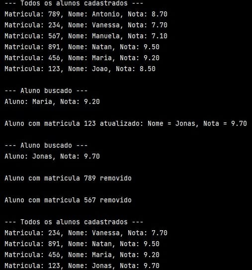

# HashMap em Zig
Uma tabela de hash (hash table), também chamada de mapa de hash (hash map), é uma estrutura de dados que 
armazena pares de chave e valor, permitindo operações de inserção, busca e remoção de forma altamente 
eficiente. Em média, essas operações apresentam complexidade O(1), embora possam se degradar para O(n) em 
casos de colisões, quando múltiplas chaves são mapeadas para o mesmo índice. Segundo Tapia-Fernández, 
García-García e García-Hernandez (2022), a estrutura pode ser formalmente entendida como uma 
correspondência entre dois conjuntos arbitrários, K (chaves) e V (valores), representando pares (k, 
v).
          	
No Zig, a biblioteca padrão oferece a estrutura std.HashMap, uma implementação genérica de tabela de hash 
projetada para garantir operações rápidas de consulta (lookup), inserção e remoção. Assim como em outras 
linguagens, não há garantia de ordem para os elementos, e qualquer modificação na estrutura invalida 
iteradores previamente criados — regra explicitada no Zig devido ao foco em segurança e previsibilidade 
na gestão de memória.
  
Uma característica importante destacada na 
documentação é que o HashMap suporta um fator 
de carga (load 
factor) elevado, chegando a 80% por padrão. 
Isso significa que o mapa consegue manter boa 
eficiência 
mesmo quando bastante preenchido. Essa 
estrutura é particularmente útil em aplicações 
que exigem 
associações rápidas entre chaves e valores, 
como:
- Contagem de frequência de palavras em textos;
- Criação de caches, para evitar recomputações desnecessárias;
- Tabelas de tradução, como códigos de erro mapeados para mensagens;
- Cadastro indexado, por exemplo, matrículas de alunos associadas a dados pessoais.
  

A implementação do HashMap em Zig é 
parametrizada por alguns dos componentes a 
seguir:
- K (Key) – tipo da chave;
- V (Value) – tipo do valor;
- Allocator – gerencia a alocação de memória da tabela.
  

Além disso, a estrutura utiliza internamente os tipos Entry, KV e Iterator, que permitem representar 
pares chave-valor e percorrer o mapa.
As operações fundamentais oferecidas pelo HashMap incluem:

#### Criação e destruição:
- init(allocator) – cria um novo mapa associado a um alocador.
- deinit() – libera a memória utilizada, sendo obrigatório chamar essa função para evitar vazamentos.
#### Inserção:
- put(chave, valor) – insere ou substitui o valor associado a uma chave.
- putNoClobber(chave, valor)  – insere somente se a chave ainda não existir; caso contrário, retorna erro.
#### Busca e acesso:
- get(chave) – retorna o valor associado a uma chave ou null caso não exista.
- contains(chave) – verifica se determinada chave está presente no mapa.
 
#### Remoção:
- remove(chave)  – remove a entrada associada e retorna true em caso de sucesso.
- fetchRemove(chave)  – remove e retorna o par chave-valor caso exista.
#### Iteração:
- iterator() – fornece um iterador para percorrer os elementos. Importante destacar que modificações no mapa invalidam qualquer iterador ativo, o que evita comportamentos indefinidos.
 
### Exemplo Prático em Zig
Para ilustrar os conceitos de HashMap na 
prática, foi elaborado um programa simples de 
cadastro de 
alunos. Nele, uma tabela de hash é utilizada 
para associar a matrícula do aluno (a chave) 
aos seus nomes 
e suas notas, (o valor), permitindo operações 
rápidas de cadastro, busca, atualização e 
remoção.
A execução do programa resulta na seguinte 
saída, que mostra como o HashMap gerencia os 
dados 
dos alunos:

- [Implementação de HashMap](../Códigos-fonte/Zig/zigHashMap.zig)

