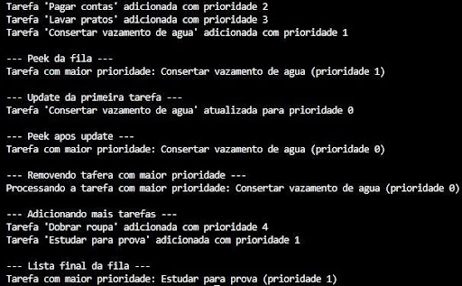

# PriorityQueue em Zig
A fila de prioridade (Priority Queue) é uma estrutura de dados de um tipo especial de fila convencional, 
mas com a característica distintiva de que cada elemento inserido recebe um nível de prioridade. Dessa 
forma, a remoção não segue estritamente a ordem de chegada (FIFO), e sim o critério de prioridade: o 
primeiro elemento a ser removido será sempre aquele com maior prioridade (Programiz, s.d.).
Essa estrutura costuma ser bastante eficiente, apresentando, em geral, tempo de inserção e remoção da 
ordem de O(log n), onde n representa a quantidade de elementos armazenados.
  
A biblioteca padrão do Zig oferece uma implementação própria dessa estrutura. De acordo com sua 
documentação oficial, a std.PriorityQueue é definida como uma "priority queue for storing generic data", 
ou seja, uma fila de prioridade destinada ao armazenamento de dados genéricos. Sua principal função é 
garantir que o elemento de maior prioridade esteja sempre acessível para consulta ou remoção.
A prioridade dos elementos é determinada por uma função de comparação (compareFn) fornecida no momento da 
criação da fila. Esse tipo de estrutura é particularmente útil em problemas que demandam o processamento
contínuo do item mais importante, como em:     	
- Algoritmos de agendamento de tarefas;
- Busca de caminhos (ex.: algoritmo de Dijkstra).
 
A PriorityQueue em Zig utiliza internamente uma heap binária (binary heap) construída sobre um array. A estrutura conta com os seguintes componentes:
- items: []T – slice genérico que armazena os elementos. A ordenação é mantida pela lógica de heap;
- cap: usize – capacidade atual do array, indicando quantos elementos podem ser armazenados antes de ser necessário realocar memória;
- allocator: Allocator – responsável pela alocação dinâmica de memória, expandindo o array quando necessário.

---
As principais operações dessa estrutura incluem:
- add - insere um novo elemento na fila, reorganizando a heap para manter a prioridade.
- remove - remove e retorna o elemento de maior prioridade.
- peek - retorna o elemento de maior prioridade sem removê-lo.
- deinit - libera a memória alocada pela fila, evitando vazamentos.
### Exemplo Prático em Zig
Para ilustrar o uso da PriorityQueue na prática, foi criado um  programa simples de agendamento de 
tarefas. Nele, cada tarefa recebe um nível de prioridade, e a fila garante que a tarefa mais urgente seja 
sempre a primeira a ser processada.
Execução do programa produz a seguinte saída, que demonstra a ordem de processamento baseada na 
prioridade das tarefas:

- [Implementação da PriorityQueue](../Códigos-fonte/Zig/zigPriorityQueue.zig)

