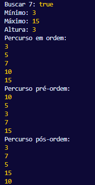

# ÁRVORES BINÁRIAS EM JAVASCRIPT
## Conceituação e Estrutura
Diferente de outras linguagens que são tipadas estaticamente, o JavaScript, com sua natureza dinâmica baseada em protótipos, oferece uma maneira flexível ainda que manual de se implementar estruturas de dados complexas como as árvores binárias. Nesta linguagem, a ausência de ponteiros explicitamente definidos é suprida por uma referência de objetos, onde cada nó é tratado como um objeto independente que armazena seu valor e mantém referências (que podem ser null) para seus filhos sejam à esquerda ou à direita (GRONER, 2019). Esse tipo de modelagem aproveita o sistema de gerenciamento de memória e coleta de lixo do JavaScript, simplificando a alocação e desalocação de nós.

---
## Princípios de Funcionamento e a Implementação com Classes JS
Em JavaScript a implementação se utiliza da sintaxe ‘Class’ que encapsula o comportamento da árvore e cada um de seus ‘nós’, oferecendo uma abstração clara e organizada. A classe ‘No’ tem a responsabilidade de criar cada elemento da árvore, iniciando com um valor e definindo as referências aos filhos como ‘null’, indicando uma ausência de descendentes. 
  
A operação de inserção, central para a construção
da árvore, é comumente implementada usando métodos
recursivos. O algoritmo compara o valor do novo nó
com o valor do nó atual. Se for menor, A tentativa
de inserção é feita na subárvore esquerda; se for
maior ou igual, esta tentativa ocorrerá na direita.
Esse processo é repetido recursivamente até
encontrar uma posição vaga(‘null’), onde o novo nó
é efetivamente alocado. É importante notar que,
embora poderosa, a recursividade em JavaScript pode
levar a erros do tipo stack overflow em árvores
muito desbalanceadas e profundas, um risco inerente
à escolha do método(CORMEN et al., 2012).
  
Para operações de busca, a mesma lógica de
comparação e recursão é aplicada. A eficiência
média O(log n) é atingida apenas se a árvore
estiver balanceada. Caso os valores sejam inseridos
em ordem crescente ou decrescente, a árvore
degenera em uma lista ligada, e a complexidade de
busca se torna O(n), um ponto de atenção crítico
para o desempenho em JavaScript, considerando que
ele apenas executa uma tarefa por vez
(single-threaded.).
  
As travessias (em-ordem, pré-ordem e pós-ordem) são
implementadas como métodos que também utilizam a
recursividade para visitar todos os nós. A
travessia ‘em-ordem’ é particularmente valiosa em
JavaScript para processar sequências ordenadas de
dados sem a necessidade de ordenar explicitamente
um array, que teria complexidade O(n log n).

---
## Exemplo de Aplicação e Características da Implementação JS
A implementação de referência (disponível no
repositório) ilustra uma árvore binária de busca
completa. Um aspecto característico do JavaScript
nesta implementação é o uso de métodos privados
(usando o prefixo #), como ‘#inserirNo’ e
‘#buscarNo’, para encapsular a lógica recursiva
interna, escondendo-a da interface pública da
classe e prevenindo seu uso inadvertido.
  
Outra particularidade é a manipulação de valores. O
JavaScript permite que a árvore armazene qualquer
tipo de valor (números, strings, até objetos),
desde que eles possam ser comparados usando os
operadores '<' e '>' . Isso pode ser tanto uma vantagem
(flexibilidade) quanto uma fonte de bugs, se tipos
diferentes forem inseridos inadvertidamente.
  
O gerenciamento de memória é implícito. Quando um
nó não é mais referenciado (por exemplo, ao ser
removido de uma estrutura pai), ele se torna
elegível para coleta de lixo, liberando o
programador da responsabilidade de desalocação
manual, comum em linguagens de mais baixo nível.

- [Implementação de árvore](../Códigos-fonte/JavaScript/Arvore.js)

---

    Exemplo de percurso pré-ordem, formatado como árvore:
        
      10
     /  \
     5   15
    / \
    3  7